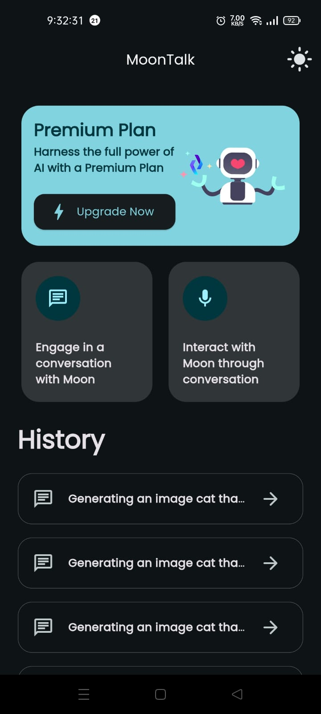
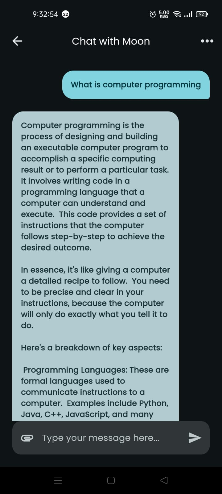
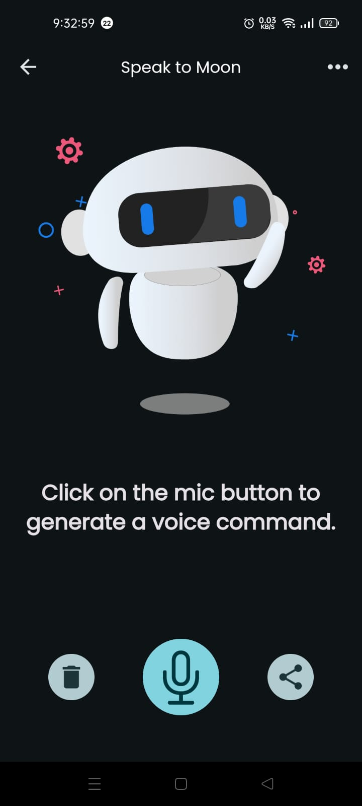

# MoonTalk

MoonTalk is a Flutter application that allows users to interact with an AI assistant through both text and voice commands. The app features a sleek and modern UI, with support for both light and dark themes.

## Features

- **Chat with AI**: Engage in text-based conversations with the AI.
- **Speak to AI**: Use voice commands to interact with the AI.
- **Theme Toggle**: Switch between light and dark themes.
- **Premium Plan**: Access enhanced features with a premium subscription.

## Screenshots





## Installation

1. **Clone the repository:**

   ```bash
   git clone https://github.com/OmarHossam666/MoonTalkApp.git
   cd MoonTalkApp
   ```

2. **Install dependencies:**

   ```bash
   flutter pub get
   ```

3. **Run the app:**

   ```bash
   flutter run
   ```

## Dependencies

- `flutter_gemini`: For AI interactions.
- `speech_to_text`: For speech recognition.
- `flutter_tts`: For text-to-speech functionality.
- `lottie`: For animations.
- `share_plus`: For sharing content.

## Project Structure

- `lib/main.dart`: Main application setup and theme management.
- `lib/pages/`: Contains the main pages of the app (Home, Chat, Speak).
- `lib/widgets/`: Reusable UI components.
- `lib/models/`: Data models used in the app.
- `lib/theme.dart`: Theme configurations.
- `lib/secrets.dart`: API keys and sensitive information.
